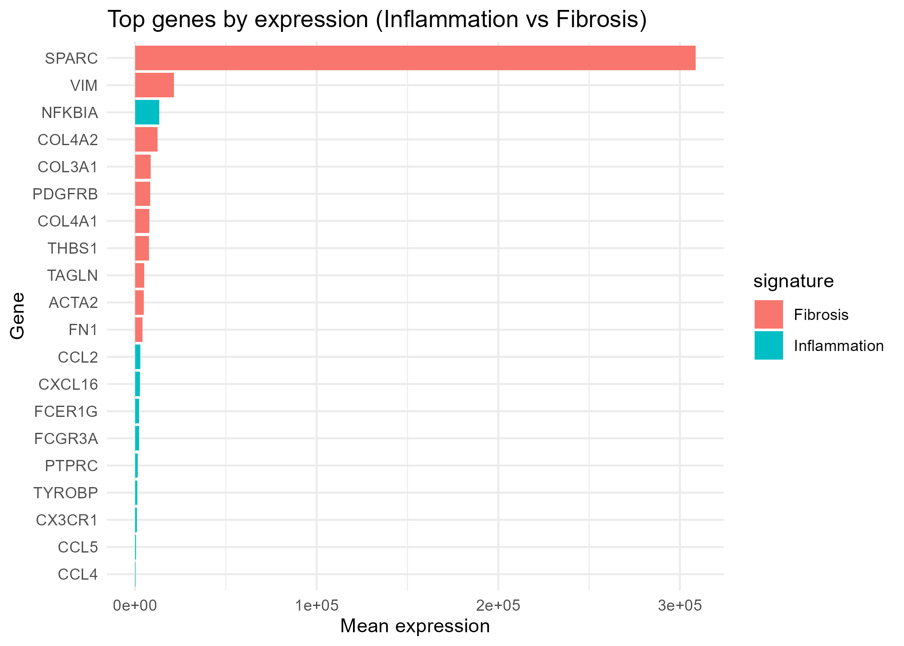

# FSGS RNA-seq – Fibrosis Progression Signature

Can transcriptomic patterns reveal biologically meaningful subgroups and fibrosis-related signals in FSGS?

---

## Key Findings

* Distinct transcriptomic clusters suggest biological heterogeneity in FSGS
* Fibrosis and inflammatory pathways are consistently enriched in specific patient subgroups
* Gene expression patterns reflect underlying disease mechanisms beyond routine clinical variables

---

## Clinical Context

Focal segmental glomerulosclerosis (FSGS) is a heterogeneous glomerular disease with variable clinical progression and treatment response.

Traditional clinical parameters often fail to fully capture disease behavior. Transcriptomic analysis offers an opportunity to explore underlying molecular patterns associated with fibrosis, inflammation, and disease heterogeneity.

---

## Data

Main project inputs:

* Expression matrix: `data/processed/fsgs_counts_final.csv`
* Metadata: `data/metadata/fsgs_metadata_final.csv`

The analysis is based on curated RNA-seq data and corresponding clinical metadata.

---

## Methods

### Analytical Strategy

The workflow was designed to prioritize interpretability and reproducibility:

* Direct use of expression matrix and curated metadata
* Removal of zero-variance genes after detecting PCA instability
* Dimensionality reduction using PCA
* Unsupervised clustering to identify transcriptomic subgroups
* Differential expression analysis to characterize cluster differences
* Functional enrichment analysis (GO and KEGG)

---

### Workflow

1. Load and validate expression matrix
2. Curate metadata and define analysis cohort
3. Preprocess expression data
4. Remove zero-variance genes
5. Perform PCA for exploratory analysis
6. Apply patient clustering
7. Evaluate fibrosis and inflammation signals
8. Generate heatmaps and signature patterns
9. Perform differential expression analysis
10. Perform functional enrichment analysis

---

## Results

### Patient Clustering

Two main transcriptomic clusters were identified:

* Cluster 1: 11 samples
* Cluster 2: 90 samples

The presence of a smaller cluster suggests a biologically distinct subgroup, potentially reflecting a more severe or differentiated disease phenotype.

---

### Biological Signals

The analysis highlights two dominant processes:

#### 1. Fibrosis-related activity

* Enrichment of extracellular matrix and structural pathways
* Increased expression of fibrosis-associated genes

#### 2. Inflammatory signaling

* Activation of immune-related pathways
* Evidence of inflammatory contribution to disease progression

---

### Visualization Outputs

Key outputs include:

* PCA plots (patient structure)
* Heatmaps (gene expression patterns)
* Volcano plots (differential expression)
* Enrichment dotplots (GO and KEGG)
* Top gene signatures

---

## Interpretation

FSGS is not a uniform disease.

Transcriptomic analysis reveals:

* Distinct molecular subgroups
* Variable activation of fibrosis and inflammatory pathways
* Biological heterogeneity not captured by clinical variables alone

---

## Limitations

* Moderate sample size
* Lack of external validation cohort
* No integration with longitudinal clinical outcomes

---

## Why This Matters

This project demonstrates that:

* Transcriptomic data can reveal biologically meaningful subgroups
* Molecular patterns may help refine disease understanding
* Interpretation of biological signals is more valuable than pipeline complexity

---

## Reproducibility

Repository structure:

* `data/`
* `scripts/`
* `results/`
* `results/figures/`

Outputs include clustering results, differential expression tables, enrichment analysis, and visualization figures.

---

## Author

Cristian Arias, MD
Internal Medicine & Nephrology  
Healthcare Data Analyst  
Bioinformatics Master's Candidate  

Focused on clinical data analysis and translational applications in kidney disease.